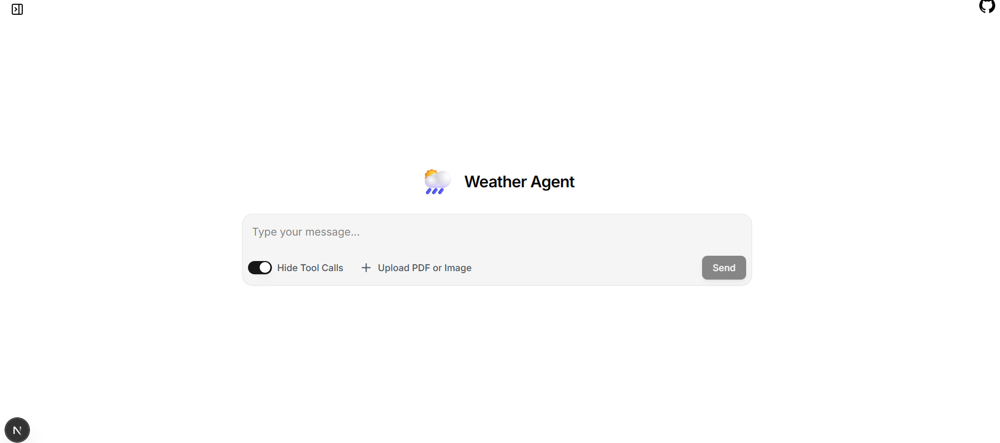
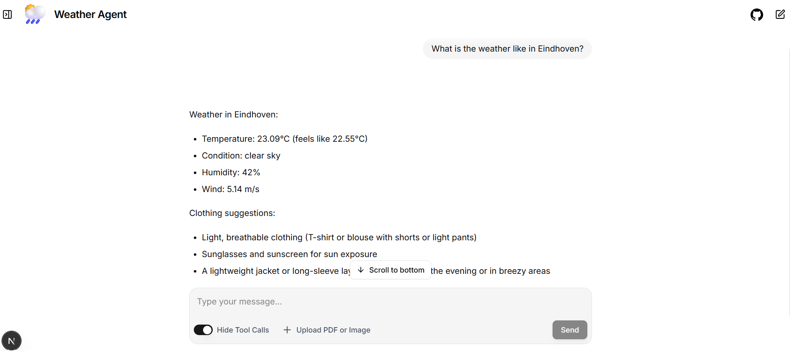

# Weather App

A conversational command-line and ui-ready application powered by LangChain that provides real-time weather conditions and clothing suggestions. It uses a Large Language Model (gpt-5-nano) equipped with an OpenWeatherMap tool to fetch live data based on user input.

## Features
- Real-time Weather Data: Fetches live temperature, humidity, wind speed, and weather conditions using the OpenWeather API.
- Smart Recommendations: Uses an LLM agent to provide tailored clothing suggestions based on the current weather.
- Continuous Chat Loop: Stay in the terminal and ask about multiple cities without restarting the script.

## Prerequisites
- Before running this application, you must have to add your OpenWeather and OpenAI keys.
- Run 'pip install -r requirements.txt' in order to download all the depndencies.

## Command Line Usage

- Start the application: Open your terminal in the root folder of the project and run the main Python script: python weather_app.py
- Chat with the agent: Once the app starts, it will prompt you with Type your text:. Ask about any city (e.g., "What is the weather like in Athens?") and press Enter.
- Get recommendations: The agent will fetch the live weather data and print out the conditions along with what you should wear.
- Exit the app: The chat runs in a continuous loop. Whenever you are done, simply type exit to close the application safely.

### Command Line Example Interaction

```
Type your text: What is the weather like in Amsterdam?

Weather in Amsterdam:
- Temperature: 21.19°C (feels like 20.8°C)
- Condition: clear sky
- Humidity: 55%
- Wind: 6.17 m/s

Clothing suggestions:
- Light and breathable clothing (t-shirt and shorts or light trousers)
- A light jacket or cardigan for the breeze
- Sunglasses if you'll be outdoors

Type your text: How is the weather in Athens? 

Weather in Athens right now:
- Temperature: 37.0°C (feels like 37.5°C)
- Condition: clear sky
- Humidity: 29%
- Wind: 6.7 m/s

Clothing suggestions:
- Wear light, breathable fabrics (cotton, linen) and loose-fitting clothes.
- A wide-brimmed hat and sunglasses for sun protection.
- Sunscreen SPF 30+ on exposed skin.
- Stay hydrated; carry water and take frequent sips.
- Consider shade or indoor breaks during peak sun hours (roughly 11 AM–4 PM).
- Comfortable sandals or breathable shoes.

Type your text: exit

Exiting the weather application.
```

## UI Usage 

This project includes a web-based user interface powered by Next.js, adapted from the official LangChain agent-chat-ui template. It allows you to interact with the Weather Agent in a browser instead of the terminal.
- Find the correct folder: cd agent-chat-ui
- Install the necessary JavaScript dependencies: pnpm install
- Start the local development server: pnpm dev

### UI Example Interaction


